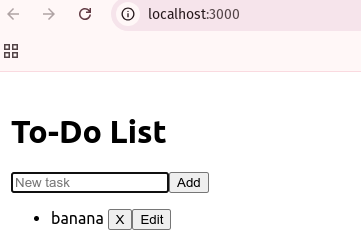
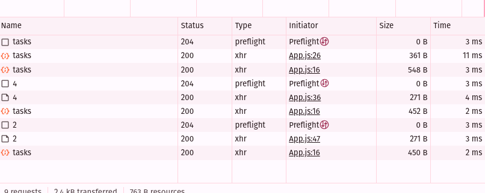
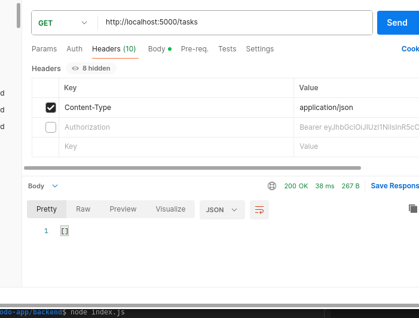
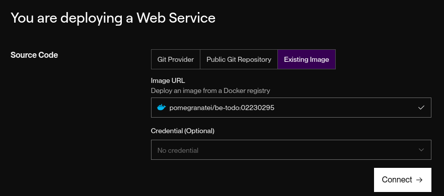
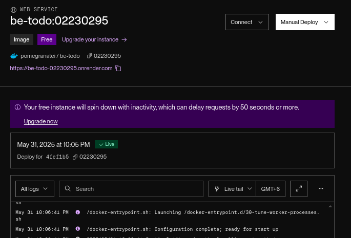
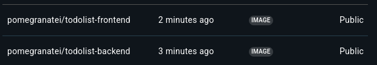
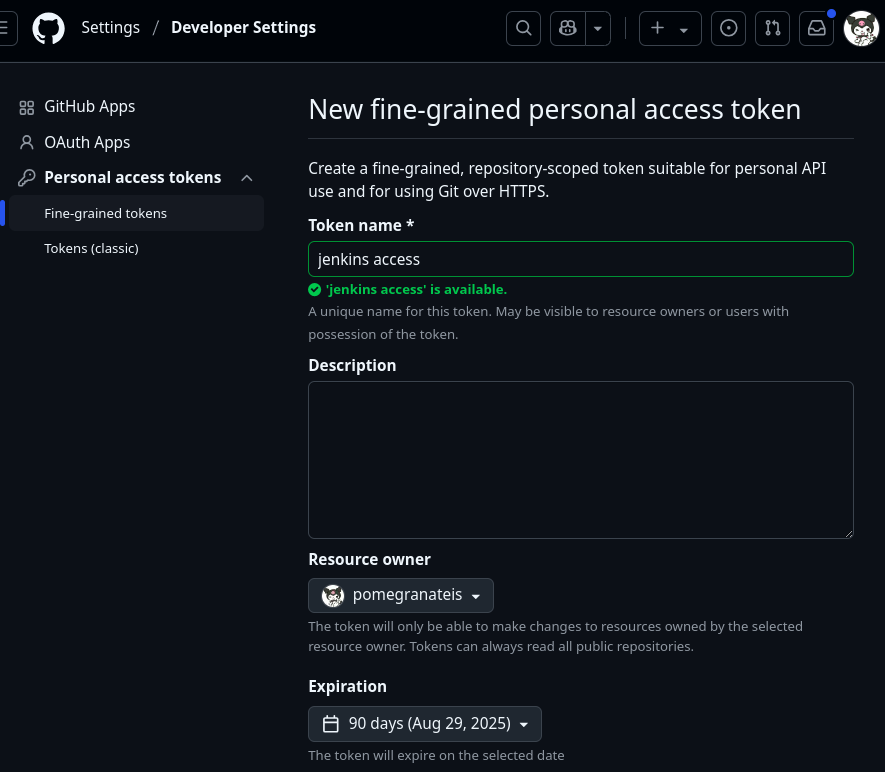
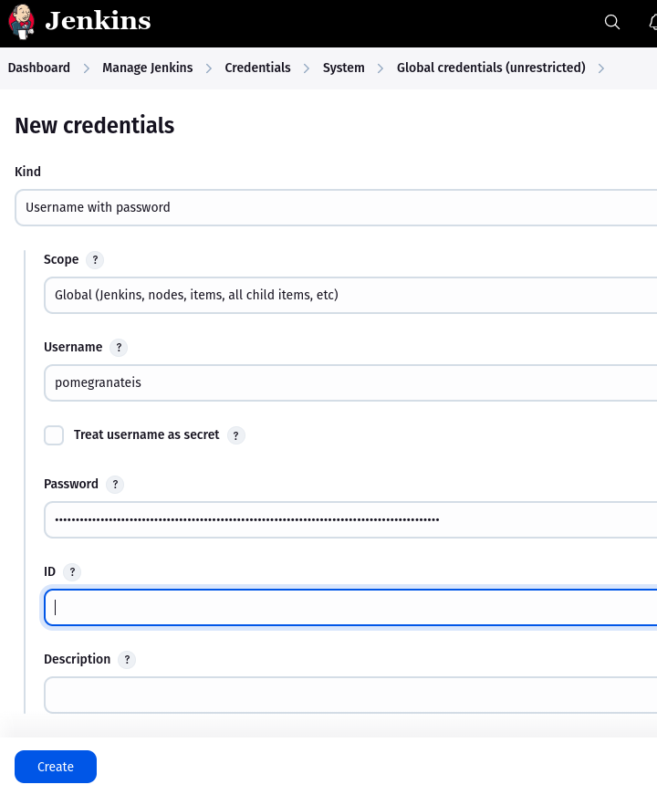
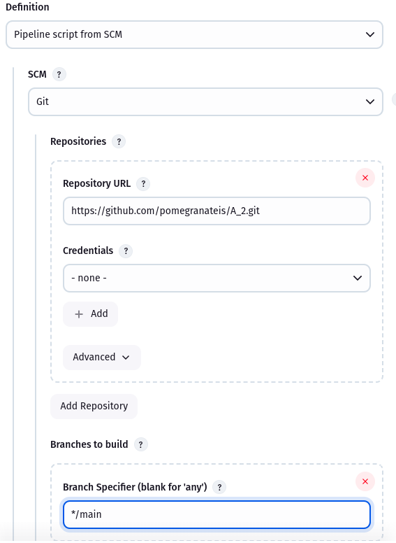
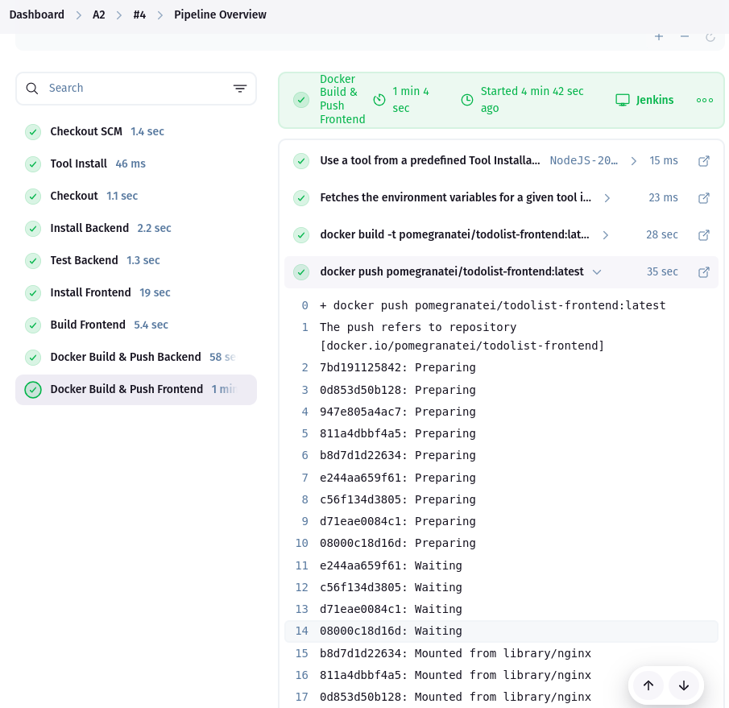

# Assignment 1 – Building & Deploying the Application

## Application Development
This project is a full-stack ToDo List web application composed of:
- **Frontend:**
  - Built using React
  - Implements task creation, deletion, and update
  



  - Axios used for API calls
- **Backend:**
  - Express server with routes for `/tasks` (GET, POST, PUT, DELETE)
  - Connects to PostgreSQL using `pg` library



- **Database:**
  - Tasks stored with fields: `id`, `description`, `is_complete`, `created_at`

## Environment Variables
- Frontend:
  ```env
  REACT_APP_API_URL=http://localhost:5000

- Backend:
  ```env
  PORT=5000
  DB_HOST=localhost
  DB_USER=postgres
  DB_PASSWORD=password
  DB_NAME=todolist
  ```
## Dockerization

- Backend `Dockerfile`
```dockerfile
FROM node:18-alpine
WORKDIR /app
COPY package*.json ./
RUN npm install
COPY . .
EXPOSE 5000
CMD ["node", "index.js"]
```

- Frontend `Dockerfile`
```dockerfile
FROM node:18-alpine AS build
WORKDIR /app
COPY package*.json ./
RUN npm install
COPY . .
RUN npm run build

FROM nginx:alpine
COPY --from=build /app/build /usr/share/nginx/html
EXPOSE 80
CMD ["nginx", "-g", "daemon off;"]
```

## Pushing Images to Docker Hub

```bash
# Backend
docker build -t pomegranatei/be-todo:02230295 ./backend
docker push pomegranatei/be-todo:02230295

# Frontend
docker build -t pomegranatei/fe-todo:02230295 ./frontend
docker push pomegranatei/fe-todo:02230295
```

## Deploying on Render.com

* **Backend Image**: [pomegranatei/fe-todo:02230295](https://be-todo-02230295.onrender.com)




* **Frontend Image**: [pomegranatei/fe-todo:02230295](https://fe-todo-02230295.onrender.com)


## Challenges Faced

- CORS Errors in React Frontend
   - **Problem**: While testing the frontend locally, Axios requests to the backend threw CORS errors.
   - **Cause**: The backend did not have proper CORS configuration.
   - **Solution**: Installed and configured the cors package in backend/index.js

- Task Operations Not Working in Docker
   - **Problem**: Edit and add task features worked when running locally (node index.js) but failed when using the Docker image.
   - **Cause**: Docker image was outdated or used incorrect .env settings.
   - **Solution**: Rebuilt Docker images after fixing code and .env variables:

- Render Backend Not Connecting to Database
   - **Problem**: Render backend failed to start due to DB connection errors.
   - **Cause**: Missing or incorrect `DB_HOST`, `DB_USER`, and `DB_PASSWORD`.
   - **Solution**: Retrieved correct credentials from Render's PostgreSQL dashboard and added them to `.env.production` and Render's environment tab.

# Assignment 2 – CI/CD Pipeline for ToDo App

## Project Overview

This project is a full-stack ToDo List web application composed of:
- **Frontend:** React
- **Backend:** Node.js + Express
- **Database:** PostgreSQL
- **CI/CD:** Jenkins Pipeline
- **Containerization:** Docker + DockerHub

## Jenkins Pipeline Stages

### Jenkinsfile (Declarative Pipeline)
The pipeline consists of the following stages:

1. **Checkout**
   - Clones GitHub repository

2. **Install Backend**
   - Runs `npm install` in `backend/`

3. **Test Backend**
   - Runs `npm test` using Jest
   - Publishes results using JUnit

4. **Install Frontend**
   - Runs `npm install` in `frontend/`

5. **Build Frontend**
   - Runs `npm run build` to generate production bundle

6. **Docker Build & Push Backend**
   - Builds Docker image from `backend/Dockerfile`
   - Pushes to DockerHub as `pomegranatei/todolist-backend:latest`

7. **Docker Build & Push Frontend**
   - Builds Docker image from `frontend/Dockerfile`
   - Pushes to DockerHub as `pomegranatei/todolist-frontend:latest`


## DockerHub Repositories

- Backend: [docker.io/pomegranatei/todolist-backend](https://hub.docker.com/r/pomegranatei/todolist-backend)
- Frontend: [docker.io/pomegranatei/todolist-frontend](https://hub.docker.com/r/pomegranatei/todolist-frontend)



## Deployment

- Creating credentials in Jenkins for GitHub




## Testing

- Jest used for backend unit testing
- Example test in `backend/test/basic.test.js`
- Results published in Jenkins via JUnit plugin



## Challenges Faced
- Jenkins "No such DSL method 'steps'" Error
   - **Problem**: Pipeline failed with `No such DSL method 'steps'` error.
   - **Cause**: Incorrect use of `steps` block inside a Scripted Pipeline context.
   - **Solution**: Rewrote the `Jenkinsfile` using proper Declarative syntax with `pipeline { agent any ... }.`

- Outdated Code in Docker Build
   - **Problem**: Jenkins built and pushed old code version.
   - **Cause**: Local edits not committed before pushing.
   - **Solution**: Always commit + push before triggering Jenkins

## Conclusion



This pipeline demonstrates a complete CI/CD flow using Jenkins, Docker, and GitHub. All major development lifecycle stages — build, test, and deploy — are automated for both frontend and backend.

# As